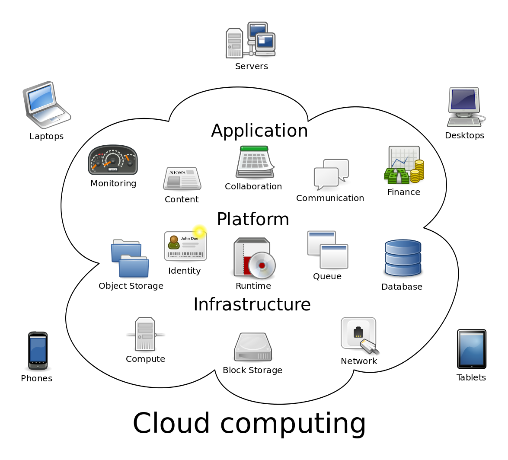
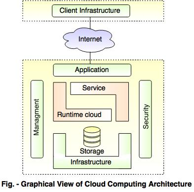
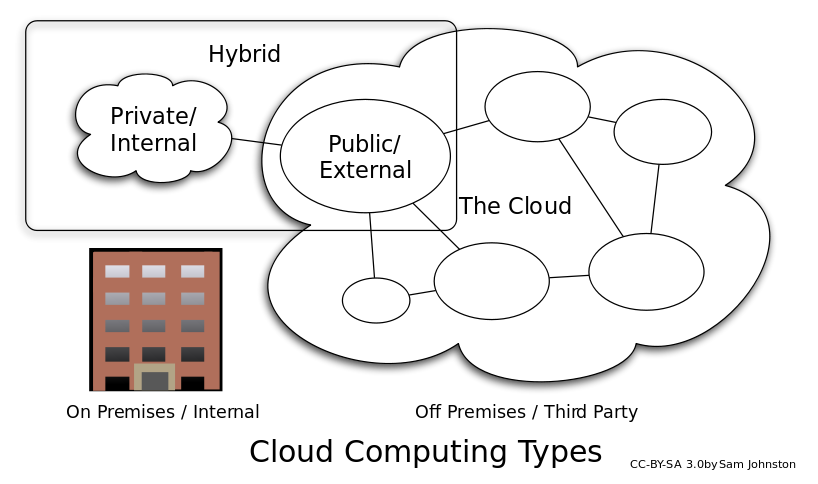

# Experiment 01

## A study of Cloud Computing & Architecture

### Definition of Cloud
Cloud computing is a model for enabling ubiquitous, convenient, on-demand network access to a shared pool of configurable computing resources that can be rapidly provisioned and released with minimal management effort or service provider interaction.[1](https://www.nist.gov/news-events/news/2011/10/final-version-nist-cloud-computing-definition-published)

### Cloud Computing Architecture

Front End
  - Client Infrastructure - The front end refers to the client part of cloud computing system. It consists of interfaces and applications that are required to access the cloud computing platforms, Example - Web Browser.

Back End
 - It consists of all the resources required to provide cloud computing services.
 - The back end is the cloud section of the system.
 - It involves all the resources which are necessary to give Cloud computing services.
 - It includes huge data storage, virtual machines, security mechanism, services, deployment models, servers etc.
 - To give built-in security mechanism, traffic control and protocols is the responsibility of the back end.

### Characteristics of a Cloud

 - High scalability - It means on demand provisioning of resources on a large scale without requiring human interaction with each service provider.

 - High availability and reliability - Availability of servers is more reliable and high because it minimizes the chances of infrastructure failure.

 - Agility - It shares the resources between users and works very quickly.  

 - Multi-sharing - Multiple user and applications work more efficiently with less cost by sharing common infrastructure using cloud computing.

 - Maintenance - Maintenance of cloud computing applications is  easier as they are not required to be install on each computer and can also be accessed from various places, ultimately reducing the cost.

 - Low cost - It is cost effective because the company no more needs to set its own infrastructure. It pays according to resources it has consumed.

 - Services in pay-per-use mode - APIs(Application Programming Interfaces) are provided to the users for accessing the services on the cloud and pay according to use of the service.

### Types of Cloud Services

1. SAAS

2. PAAS

3. IAAS

4. NAAS

5. IdAAS

6. SecAAS

### Different Types of Cloud Deployment Models

1. Public Cloud - A cloud is called a "public cloud" when the services are rendered over a network that is open for public use. Public cloud services may be free. Technically there may be little or no difference between public and private cloud architecture, however, security consideration may be substantially different for services that are made available by a service provider for a public audience and when communication is effected over a non-trusted network.

2. Private Cloud - Private cloud is cloud infrastructure operated solely for a single organization, whether managed internally or by a third party, and hosted either internally or externally. Undertaking a private cloud project requires significant engagement to virtualize the business environment, and requires the organization to reevaluate decisions about existing resources. It can improve business, but every step in the project raises security issues that must be addressed to prevent serious vulnerabilities.

3. Hybrid Cloud - Hybrid cloud is a composition of two or more clouds (private, community or public) that remain distinct entities but are bound together, offering the benefits of multiple deployment models. Hybrid cloud can also mean the ability to connect collocation, managed and/or dedicated services with cloud resources.

Other types of Cloud Deployment Models
- Community Cloud - Community cloud shares infrastructure between several organizations from a specific community with common concerns (security, compliance, jurisdiction, etc.), whether managed internally or by a third-party, and either hosted internally or externally.
- Distributed cloud
- Multicloud
- Big Data cloud
- HPC cloud

###Advantages and Disadvantages of Cloud Computing
#### Advantages
- Cost - Hardware and software maintenance cost is reduced using the cloud.  
- Performance - Fast processing of applications as cloud server's capacity of execution is very high.  
    A huge amount of storage capacity is provided by cloud.
- Better Resource Utilisation - The requirement for large number of powerful servers and IT staff to handle them goes down.
- Scalability - Scaling out a cloud service is easier to accomplish as the application itself is not tied down to the infrastructure.
- *Security* - The cloud computing vendors ensure highly secured password protected accounts.

### Disadvantages
- Internet Requirement - Without an Internet connection cloud computing is impossible because, to access any application or document a constant internet connection is a must.
- Minimum Resource Requirement It also requires high speed internet connection because web based apps need a lot of bandwidth to download (large document).
- Locality - The actual location of user data is unknown and may be subject to different rules and laws than those applicable to the user themself.
- *Security* - Security of data on the cloud can be questionable. Since data management and infrastructure management in cloud is provided by third-party, it is always a risk to handover the sensitive information to cloud service providers.
- Insecure or Incomplete Data Deletion - It is possible that the data requested for deletion may not get deleted.
